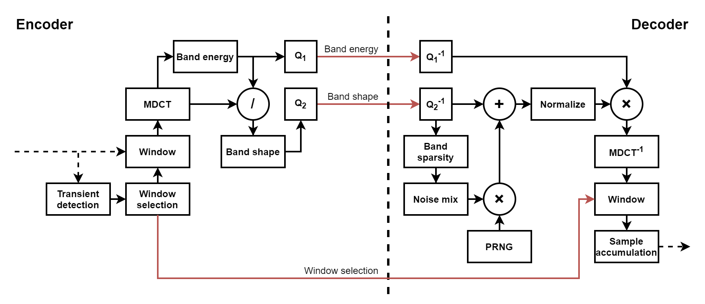

# pulsejet

A bespoke sample compression codec for [64K intros](https://en.wikipedia.org/wiki/64K_intro)



## codec

pulsejet lifts a lot of ideas from [Opus](https://opus-codec.org/), and more specifically, its [CELT](https://en.wikipedia.org/wiki/CELT) layer, which is used for coding musical signals. [This blog post](https://yupferris.github.io/blog/2021/06/07/pulsejet-sample-compression-codec-for-64k.html) outlines much of the current codec design, as well as provides some background behind why certain decisions were made.

Relatively speaking, pulsejet is in its early days, and is admittedly pretty crude, especially the encoder. Surprisingly, though, it already appears to be quite good, as well as works around a lot of other issues with using existing codecs, hence the standalone public release. Expect further development/versions of this library, as well as integration in [WaveSabre](https://github.com/logicomacorp/WaveSabre).

## comparisons

An up-to-date listening test matrix can be found [here](http://logicoma.io/pulsejet/), though it's a good idea to review [this blog post section](https://yupferris.github.io/blog/2021/06/07/pulsejet-sample-compression-codec-for-64k.html#results) in order to better understand what you're actually listening to before making any judgments.

## releases

See [releases](https://github.com/logicomacorp/pulsejet/releases) and [changelog](https://github.com/logicomacorp/pulsejet/blob/master/CHANGELOG.md) for release information.

## usage

pulsejet's [decoder API](include/Pulsejet/Decode.hpp) is meant to be integrated with software synthesizers (for example, [WaveSabre](https://github.com/logicomacorp/WaveSabre)) in size-constrained environments. As such, it only relies on basic C/C++ facilities to allocate/free memory, cast data types, etc. However, it does _not_ rely on existing math functions, as many of these are often unavailable in such environments, and so must be implemented by the user. Luckily, software synthesizers typically already have some or all of the required functions available. Further, sine/cosine functions are often reimplemented for improved performance, rather than to work around artificial limitations.

pulsejet's [encoder](include/Pulsejet/Encode.hpp) and [meta](include/Pulsejet/Meta.hpp) APIs, on the other hand, are meant to be integrated into authorship tools, which are not size-constrained. As such, they rely on the C/C++ standard libraries to more conveniently implement more complex logic. However, the encoder still relies on user-provided sine/cosine implementations in order to support potential speed optimizations.

Essentially, some or all of the pulsejet library can be used in a number of different ways and in different configurations. For these reasons, pulsejet is a [header-only](https://en.wikipedia.org/wiki/Header-only) library. By distributing only source code, the user can control the specific compilation flags necessary to build the code appropriately in their existing environment. By distributing only headers, we can provide a mechanism by which the few dependencies that pulsejet has can be configured by the user, and trivially include/exclude some or all of the library, depending on how it will be used.

The [`include` directory](include/) should be copied (or otherwise made available somehow) in its entirety to allow the public API header(s) to access the appropriate internal support header(s). From there, one or more of the appropriate header(s) should be `#include`d:
 - To use just the decoder API, only `#include` [Pulsejet/Decode.hpp](include/Pulsejet/Decode.hpp).
 - To use just the encoder API, only `#include` [Pulsejet/Encode.hpp](include/Pulsejet/Encode.hpp).
 - To use just the meta API, only `#include` [Pulsejet/Meta.hpp](include/Pulsejet/Meta.hpp).
 - To use the whole API (or if you want to be lazy and aren't working with artificial constraints), `#include` [Pulsejet/Pulsejet.hpp](include/Pulsejet/Pulsejet.hpp).

If shims are required (only the encoder and decoder APIs require them), they should be defined in the `Pulsejet::Shims` namespace before `#include`'ing the pulsejet header(s). See the included [demo application source](demo/Demo.cpp) for how to do this, and the individual doc comments in the source for which shim(s) need to be provided for your use case.

pulsejet's encoder and decoder APIs only accept/output raw, mono floating point PCM sample data, and won't do any sort of mixing/sample rate conversion/etc. This is the job of another library or tool, eg. [ffmpeg](https://www.ffmpeg.org/).

## converting `.wav` <-> `.raw`

Convert `.wav` to appropriate raw floating point PCM:

```
ffmpeg -i <input.wav> -f f32le -ac 1 -c:a pcm_f32le <output.raw>
```

Convert raw floating point PCM to `.wav`:

```
ffmpeg -f f32le -ar 44100 -i <input.raw> <output.wav>
```

## demo

The included [demo application](demo/Demo.cpp), while tiny, is meant to serve as a simple example of how to use the entire pulsejet API, as well as an easy way to test out the codec before actually integrating it into anything. Its basic CLI usage is:

```
Usage:
  encode: pulsejet_demo -e <target bit rate in kbps> <input.raw> <output.pulsejet>
  decode: pulsejet_demo -d <input.pulsejet> <output.raw>
```

A typical round-trip test might look like this:

```bash
# Convert original .wav sample to .raw (and potentially downmix to mono, if it isn't already)
ffmpeg -i my_sample_original.wav -f f32le -ac 1 -c:a pcm_f32le my_sample_original.raw
# Encode sample
./pulsejet_demo -e 32 my_sample_original.raw my_sample.pulsejet
# Decode sample
./pulsejet_demo -d my_sample.pulsejet my_sample_roundtripped.raw
# Convert decoded sample from .raw to .wav
ffmpeg -f f32le -ar 44100 -i my_sample_roundtripped.raw my_sample_roundtripped.wav
```

## attribution

pulsejet is primarily inspired by [Opus](https://opus-codec.org/), and more specifically, its CELT layer. Additionally, several other articles and writings by the [Xiph.Org Foundatation](https://xiph.org/) have been incredibly enlightening and inspiring. The work that these folks have done in the open codec space is nothing short of heroic, and without that work, pulsejet would never have been possible. So, huge thanks to them!

## FAQ

> My encoded pulsejet sample is about half the size of the raw sample, even though the size estimate from the demo said it would only be a fraction of this. What gives?

pulsejet doesn't include an [entropy coding](https://en.wikipedia.org/wiki/Entropy_encoding) stage because in 64k intros, there's typically a very powerful general-purpose compressor already present in the executable packer used (for example, [squishy](http://logicoma.io/squishy/)). The size estimate from the pulsejet encoder refers to the _final compressed size_ in the intro, not the _encoded size_. To check if the estimate is in the right ballpark, a decent compressor like [7-Zip](https://www.7-zip.org/) can be used, but bear in mind its ratio is typically a few percent worse than [squishy](http://logicoma.io/squishy/)'s (which the pulsejet's encoder estimation is tuned to). Additionally, the estimate is still an estimate, and while it tends to be fairly correct on average, no guarantees are made here.

> How large is the pulsejet decoder after compression?

About 750 bytes, give or take, depending on what else is in the executable and which packer is used. This can surely be code golfed more, and I expect this will improve in future library versions.

> Why not use a better codec that's already included in most target environments like [Opus](https://opus-codec.org/)?

There are several reasons, including:
 - On relevant material and at our target bit rates, pulsejet is actually already surprisingly competitive, despite being so crude - so "better" is relative. Listen/compare for yourself [here](http://logicoma.io/pulsejet/). pulsejet has a lot of room for improvement as well, particularly on the encoder side, which would allow for higher quality at current rates and/or similar quality at lower rates.
 - Because the pulsejet decoder is entirely self-contained (no dependencies on any specific OS features), it works with basically any platform we'd ever want to target, without any fuss or worry about future API breakages.
 - Having an easy-to-integrate encoder library with a permissive license makes tooling integration much easier than it otherwise would be, which can be a real pain for some codecs/encoders (eg. [HE-AAC](https://en.wikipedia.org/wiki/High-Efficiency_Advanced_Audio_Coding)).

Besides, let's be honest: it's just plain rad to have our own codec!

[This blog post](https://yupferris.github.io/blog/2021/06/07/pulsejet-sample-compression-codec-for-64k.html) has more in-depth information behind the codec, its design, and the motivation for building a custom codec in the first place.

## license

pulsejet is licensed under the MIT license (see [LICENSE](LICENSE) or http://opensource.org/licenses/MIT).
